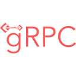
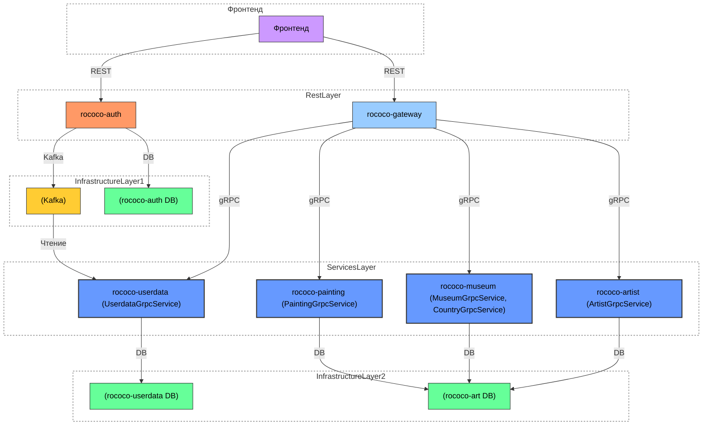

# Проект Rococo

   

> Rococo — сервис для управления данными о художниках, музеях и произведениях искусства с микросервисной архитектурой и
> интеграцией с Kafka.

---
> *Frontend часть проекта предоставлена платформой [QA.GURU](https://qa.guru/).*  
> ***Автор реализации:***  
> :octocat: *[Дмитрий Тучс](https://github.com/dtuchs)*  
> :telephone: *[Telegram канал](https://t.me/likeaduck)*
---

### :hammer_and_wrench: Используемые инструменты и технологии:

<p align="center">
  <a href="https://spring.io/"></a>
  <a href="https://spring.io/projects/spring-boot"></a>
  <a href="https://yidongnan.github.io/grpc-spring-boot-starter/"></a>
  <a href="https://kafka.apache.org/"></a>
  <a href="https://www.docker.com/"></a>
  <a href="https://www.mysql.com/"></a>
  <a href="https://svelte.dev/"></a>
  <a href="https://junit.org/junit5/"></a>
  <a href="https://rest-assured.io"></a>
  <a href="https://qameta.io/allure/"></a>
  <a href="https://selenide.org/"></a>
  <a href="https://aerokube.com/selenoid/"></a>
  <a href="https://github.com/fescobar/allure-docker-service"></a>
  <a href="https://github.com/features/actions"></a>
  <a href="https://www.jetbrains.com/idea/"></a>
  <a href="https://www.java.com/"></a>
  <a href="https://github.com/"></a>
  <a href="https://gradle.org/"></a>
  <a href="https://wiremock.org/"></a>
</p>

---

## :scroll: Содержание:

+ [:building_construction: Архитектура системы](#building_construction-архитектура-системы)
+ [:warning: Минимальные требования](#warning-минимальные-требования)
+ [:rocket: Запуск проекта](#rocket-запуск-проекта)
    - [:desktop_computer: Локальный запуск](#desktop_computer-локальный-запуск)
        - [:electric_plug: Доступные сервисы](#electric_plug-доступные-сервисы)
    - [:whale: Запуск в Docker](#whale-запуск-в-docker)
+ [:mag: Тестирование](#mag-тестирование)
    - [:microscope: Unit-тесты](#microscope-unit-тесты)
    - [:handshake: Контрактные тесты](#handshake-контрактные-тесты)
    - [:gear: Интеграционные тесты](#gear-интеграционные-тесты)
    - [:spider_web: Web тесты](#spider_web-web-тесты)
+ [:warning: Минимальные требования](#warning-минимальные-требования)
+ [:rocket: Запуск проекта](#rocket-запуск-проекта)
    - [:desktop_computer: Локальный запуск](#desktop_computer-локальный-запуск)
        - [:electric_plug: Доступные сервисы](#electric_plug-доступные-сервисы)
    - [:whale: Запуск в Docker](#whale-запуск-в-docker)
+ [:mag: Тестирование](#mag-тестирование)
    - [:microscope: Unit-тесты](#microscope-unit-тесты)
    - [:handshake: Контрактные тесты](#handshake-контрактные-тесты)
    - [:gear: Интеграционные тесты](#gear-интеграционные-тесты)
    - [:spider_web: Web тесты](#spider_web-web-тесты)

---

## :building_construction: Архитектура системы



### :nut_and_bolt: Компоненты системы:

- **Frontend**: Веб-интерфейс (Svelte)
- **API Gateway**: Единая точка входа для всех запросов
- **Auth Service**: Аутентификация и авторизация
- **User Service**: Управление профилями пользователей
- **Artist Service**: Данные о художниках
- **Museum Service**: Информация о музеях и странах
- **Painting Service**: Каталог произведений искусства
- **Kafka**: Брокер сообщений для событий аутентификации
- **Базы данных**: Раздельное хранение пользовательских и арт-данных

---

## :warning: Минимальные требования

### Для Windows ОС:

1. **Обязательно** использовать [Git Bash](https://www.geeksforgeeks.org/working-on-git-bash/) вместо PowerShell/CMD
2. Требуется активировать WSL 2 перед установкой Docker

### :whale: Установка Docker:

| ОС            | Инструкция                                                                         |
|---------------|------------------------------------------------------------------------------------|
| Windows       | [Официальный установщик](https://docs.docker.com/desktop/install/windows-install/) |
| macOS (Intel) | [Docker для Intel](https://docs.docker.com/desktop/install/mac-install/)           |
| macOS (ARM)   | [Docker для Apple Silicon](https://docs.docker.com/desktop/install/mac-install/)   |
| Linux         | [Linux установка](https://docs.docker.com/desktop/install/linux-install/)          |

**Проверка установки:**

```bash
docker -v
# Должен вывести что-то вроде:
# Docker version 20.10.14, build a224086

После установки и запуска docker daemon необходимо убедиться в работе команд docker, например `docker -v`:

User-MacBook-Pro ~ % docker -v
# Docker version 20.10.14, build a224086
```

### :package: Загрузка необходимых образов:

```bash
docker pull mysql:8.3
docker pull confluentinc/cp-zookeeper:7.3.2
docker pull confluentinc/cp-kafka:7.3.2
```

**Проверка образов:**

```bash
docker images
# Ожидаемый вывод:
# REPOSITORY                     TAG       IMAGE ID       CREATED        SIZE
# mysql                          8.3       9f3ec01f884d   10 days ago    379MB
# confluentinc/cp-kafka          7.3.2     db97697f6e28   12 months ago  457MB
# confluentinc/cp-zookeeper      7.3.2     6fe5551964f5   7 years ago    451MB
```

### :rocket: Запуск инфраструктуры:

```bash
docker compose -f docker-compose.localenv.yml up -d
```

#### Если таблицы не создаются:

```bash
docker stop rococo-mysql
docker rm rococo-mysql
docker volume rm mysql_data
```

#### 4. Установить Java версии 21. Это необходимо, т.к. проект использует синтаксис Java 21

Версию установленной Java необходимо проверить командой `java -version`

```bash
User-MacBook-Pro ~ % java -version
openjdk version "21.0.1" 2023-10-17 LTS
OpenJDK Runtime Environment Temurin-21.0.1+12 (build 21.0.1+12-LTS)
OpenJDK 64-Bit Server VM Temurin-21.0.1+12 (build 21.0.1+12-LTS, mixed mode)
```

### :coffee: Установка Java 21:

- Скачать OpenJDK [21 с официального сайта](https://adoptium.net/en-GB/temurin/releases/)
- Убедиться что Java 21 установлена по умолчанию:

```bash
java -version
# Должен показать:
# openjdk version "21.0.1" 2023-10-17 LTS
# OpenJDK Runtime Environment Temurin-21.0.1+12 (build 21.0.1+12-LTS)
# OpenJDK 64-Bit Server VM Temurin-21.0.1+12 (build 21.0.1+12-LTS, mixed mode)
```

### :art: Установка фронтенд-зависимостей:

Установить Node.js и npm по [официальной инструкции](https://docs.npmjs.com/downloading-and-installing-node-js-and-npm)
Рекомендуемая версия Node.js - 22.6.0  
*Если планируете запускать фронтенд в докере*

```bash
#Загрузить базовый шаблон Svelte с помощью degit.
npx degit sveltejs/template svelte-docker
cd svelte-docker
# Для создания файла package-lock.json
npm install 
```

### :heavy_check_mark: Финал проверки:

```bash
docker --version
java -version
node --version
npm --version
```

---

## :rocket: Запуск проекта

### :desktop_computer: Локальный запуск

1. **Запуск инфраструктуры**:

```bash
# Для запуска инфраструктуры(БД и kafka) используется docker
docker compose -f docker-compose.localenv.yml up -d
```

```bash
# Если таблицы БД не создались автоматически:
docker stop rococo-mysql
docker rm rococo-mysql
docker volume rm mysql_data
docker compose -f docker-compose.localenv.yml up -d
```

2. **Настройка Run Configurations**:

- Откройте `Run -> Edit Configurations` в IntelliJ IDEA
- Для каждого сервиса (rococo-*):
    1. Выберите соответствующий main-класс
    2. Нажмите `Modify options -> add VM options` и примените `-Dspring.profiles.active=local`
    3. Сохраните конфигурацию
- [Подробная инструкция](https://stackoverflow.com/questions/39738901/how-do-i-activate-a-spring-boot-profile-when-running-from-intellij)

3. **Запуск сервисов**:

#### Запуск rococo-auth:

```bash
cd rococo-auth
gradle bootRun --args='--spring.profiles.active=local'
```

Или через IDEA:

- Откройте RococoAuthApplication
- Запустите через контекстное меню (Run)

*Последовательность запуска остальных сервисов, не имеет значения*

#### Запуск Frontend(rococo-client):

```bash
cd rococo-client
npm i
npm run dev
# Или можно запустить командой
bash rococo-client.frontend.localenv.sh
```

#### :electric_plug: Доступные сервисы

| Сервис          | Назначение                          | Доступ                                |
|-----------------|-------------------------------------|---------------------------------------|
| rococo-gateway  | API Gateway (единая точка входа)    | http://localhost:8080                 |
| rococo-auth     | Аутентификация и авторизация        | http://localhost:9000                 |
| rococo-userdata | Управление данными пользователей    | gRPC: 9092                            |
| rococo-artist   | Управление художниками              | gRPC: 9093                            |
| rococo-museum   | Управление музеями и странами       | gRPC: 9094                            |
| rococo-painting | Управление произведениями искусства | gRPC: 9095                            |
| Kafka           | Брокер сообщений                    | localhost:9092                        |
| MySQL           | Основная база данных                | localhost:3306                        |
| Frontend        | Веб-интерфейс (Svelte)              | http://localhost:3000                 |
| Swagger UI      | Документация API                    | http://localhost:8080/swagger-ui.html |

### :whale: Запуск в Docker

#### Добавьте в файл etc/hosts:

```posh
127.0.0.1 localhost
127.0.0.1 frontend.rococo.dc
127.0.0.1 auth.rococo.dc
127.0.0.1 rococo-all-db
127.0.0.1 gateway.rococo.dc
127.0.0.1 museum.rococo.dc
127.0.0.1 artist.rococo.dc
127.0.0.1 painting.rococo.dc
127.0.0.1 userdata.rococo.dc
127.0.0.1 allure
```

#### Для полного развертывания:

```bash
bash docker-compose.sh
```

#### Для полного развертывания c прогоном автотестов:

```bash
bash docker-compose-tests.sh
```

#### Доступные сервисы в Docker-среде

| Сервис                 | Назначение                       | Доступ                             |
|------------------------|----------------------------------|------------------------------------|
| **API и микросервисы** |                                  |                                    |
| rococo-gateway         | API Gateway (единая точка входа) | http://gateway.rococo.dc:8080      |
| rococo-auth            | Аутентификация и авторизация     | http://auth.rococo.dc:9000         |
| rococo-userdata        | Управление данными пользователей | `gRPC:` userdata.rococo.dc:9090    |
| rococo-artist          | Управление художниками           | `gRPC:` artist.rococo.dc:9091      |
| rococo-museum          | Управление музеями и странами    | `gRPC:` museum.rococo.dc:9093      |
| rococo-painting        | Управление картинами             | `gRPC:` painting.rococo.dc:9094    |
| **Инфраструктура**     |                                  |                                    |
| Kafka                  | Брокер сообщений                 | `kafka:9092` (внутри сети)         |
| Zookeeper              | Координация Kafka                | `zookeeper:2181` (внутри сети)     |
| MySQL                  | Основная база данных             | `rococo-all-db:3306` (внутри сети) |
| **Frontend и UI**      |                                  |                                    |
| Frontend               | Веб-интерфейс (Svelte)           | http://frontend.rococo.dc:3000     |
| Swagger UI             | Документация API                 | http://localhost:8080/swagger-ui   |
| **Тестирование**       |                                  |                                    |
| Selenoid UI            | Управление браузерами (тесты)    | http://localhost:9095              |
| Allure UI              | Отчёты автотестов                | http://localhost:5252              |

**Примечания:**

- Внутри Docker-сети сервисы общаются по DNS-именам (например, `kafka:9092`, `rococo-all-db:3306`)
- Доступ с хоста возможен только через проброшенные порты (например, `localhost:8080` для Gateway)
- Тестовые сервисы (Selenoid, Allure) работают только с профилем `test`
- gRPC-сервисы доступны по указанным адресам внутри сети (`service-name.rococo.dc:port`)

---

## :mag: Тестирование

### :microscope: Unit-тесты

*Покрывают все бизнес-правила и сценарии*

#### Проверяемые аспекты:

- Обязательность полей при обновлении
- Обработка пустых значений
- Преобразование между Entity и gRPC моделями
- Исключения и сообщения об ошибках
- Kafka listener (создание пользователя)
- Исключения

### :handshake: Контрактные тесты

*Проверяют API и gRPC взаимодействия*

#### Проверяемые аспекты:

Получение данных

- Создание и обновление сущностей
- Структура ответов
- Обработка ошибок
- Валидация входных данных
- Безопасность и авторизация
- Интеграция с [Wiremock](https://wiremock.org/docs/standalone/docker/)

### :gear: Интеграционные тесты

*Проверяют взаимодействие между компонентами системы*

#### Проверяемые аспекты:

- Взаимодействие между микросервисами
- Согласованность данных между сервисами
- Работа с внешними зависимостями
- Поток данных через систему

#### Особенности реализации:

- Использование тестовых аннотаций (`@Artist`, `@Museum`, `@Painting`, `@User`, `@ApiLogin`)
- Проверка сквозных сценариев (end-to-end)
- Тестирование пагинации
- Валидация ответов между сервисами
- Проверка обработки ошибок в распределенной системе

### :spider_web: Web тесты

*Проверяют пользовательский интерфейс и взаимодействие с фронтендом*

#### Проверяемые аспекты:

- Авторизация и регистрация пользователей
- CRUD-операции с сущностями (художники, картины, музеи)
- Валидация форм и обработка ошибок
- Состояния системы после действий пользователя

#### Особенности реализации:

- Аннотации для подготовки данных (`@User`, `@Artist`, `@Painting`, `@Museum`)
- Параметризованные тесты для граничных значений
- Проверка toast-уведомлений и сообщений об ошибках
- Page Object Pattern для работы с элементами UI
- Интеграция с Selenoid для запуска в Docker

#### Ключевые тест-кейсы:

- Успешное добавление/обновление сущностей
- Поиск существующих записей
- Валидация полей форм
- Тестирование авторизации и профиля пользователя 